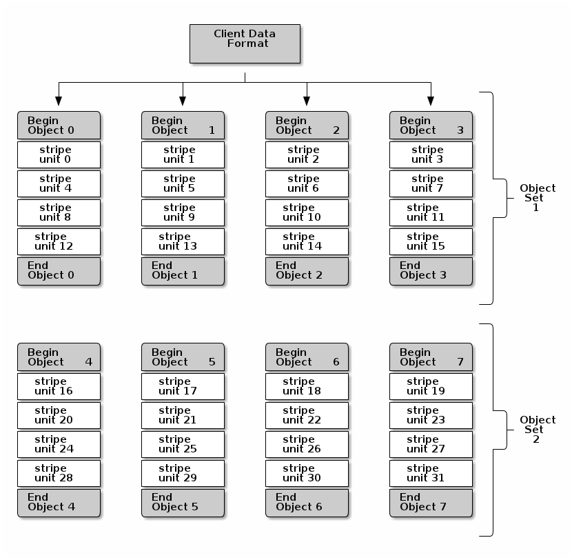

Ceph Filesystem (CephFS)
========================

Since POSIX is still the prefered access interface for many applications, Ceph
also offers a POSIX-compliant filesystem that uses RADOS to store its data.

To address issues related to performance, scalability and latency, CephFS:

* stores all files and metadata directly on RADOS, thus inheriting robustness
  and scalability of RADOS
* has a cluster of MDS to handle metadata in a scalable way
* offers extra-functionality: recursive statistics, subtree snapshots

Although CephFS in still under development and the developers present it as
*unstable*, it has come a long way in the past few years and is worth
presenting here.

A FUSE and kernel client ensure POSIX compatibility. We will use the FUSE
client throughout this tutorial.

### Create and mount CephFS

Since CephFS stores its data and metadata in RADOS, we first need to create two
separate pools for data and metadata:

    ceph osd pool create cephfs_data 64
    ceph osd pool create cephfs_metadata 32
    ceph osd pool set cephfs_metadata size 3

We set replication 3 for metadata because if the metadata is lost, the entire
filesystem will be inaccessible. It is also recommended to consider lower
latency storage (e.g. SSDs) for the metadata pool as this will directly
influence the latency of filesystem operations at the client side.

Create a ceph filesystem using the newly created pools:

    ceph fs new cephfs cephfs_metadata cephfs_data
    ceph fs ls

More data pools can be added using the command:

    ceph mds add_data_pool <pool name>

Once the filesystem is created, the MDS(s) will enter an *active* state:

    ceph mds stat

We can now mount the Ceph filesystem in user space. First, install the ceph-fuse package:

    sudo apt-get install ceph-fuse

You need the ceph config file and keyring present on the CephFS client to be able to
mount Ceph. Since we use the admin node as client, both *ceph.conf* and the
keyring are already in */etc/ceph*.

Create a new directory - the mount point for the ceph filesystem:

    sudo mkdir /mnt/cephfs

Get the IP of one of the Ceph monitors:

    ceph mon stat

and then mount the Ceph filesystem:

    sudo ceph-fuse -m 192.168.32.81:6789 /mnt/cephfs

### Basic operations

Now you can add a file just like with any other filesystem:

    cp first-object.txt /mnt/cephfs

File data is written directly from clients to RADOS. File contents are striped
across RADOS objects, named *{inode}.{offset}*:

    $ ls -l /mnt/cephfs/first-object.txt
    -rw-r--r-- 1 root root 14 Aug 28 13:24 /mnt/cephfs/first-object.txt

    $ rados -p cephfs_data ls
    10000000000.00000000

Below is a figure depicting how striping is done in CephFS:

[&copy; ceph.com](http://ceph.com/docs/master/architecture/#data-striping)

### Layout

Settings related to layout can be viewed and changed using virtual extended attributes.
For that, the *attr* package needs to be installed:

    sudo apt-get install attr

Layout also includes which pool to use when you have several data pools for
the filesystem.

Directories are broken down into fragments and stored in RADOS using key-value
stores (RADOS OMAP): filenames are keys, dentries are values. Inodes are thus
embedded in dentries, reducing latency when traversing the filesystem and
improving locality.

Let's see how CephFS stores files and directories with a simple example:

    sudo mkdir /mnt/cephfs/mydir
    sudo dd if=/dev/urandom bs=4M count=3 of=/mnt/cephfs/mydir/myfile
    rados -p cephfs_data ls
    rados -p cephfs_metadata ls

The layout is stored in the extended attributes:

    $ getfattr -n ceph.file.layout /mnt/cephfs/mydir/myfile
    ceph.file.layout="stripe_unit=4194304 stripe_count=1 object_size=4194304 pool=cephfs_data"

Directories do not have an explicit layout until it is customized:

    getfattr -n ceph.dir.layout /mnt/cephfs/mydir
    sudo setfattr -n ceph.dir.layout.object_size -v 8388608 /mnt/cephfs/mydir
    sudo setfattr -n ceph.dir.layout.stripe_unit -v 8388608 /mnt/cephfs/mydir

Files inherit the layout of their parent directory at creation time, but any
subsequent changes to the parent's layout do not affect the layout of the
children. 

-----------------------------------------------

### Exercise time

Let's simulate storing a performance sensitive directory to a pool that is
stored on SSDs. We want to stripe files over 8MB RADOS objects and write 4 files 
of different sizes to this directory (8 MB, 20 MB, 24 MB, 36 MB). How many
objects are there in the new pool?

**Hint:** create a new data pool and add it to the filesystem. Create a new
directory and change its layout using xattr to store it in the new pool, as well as the
striping settings. Then add the 4 objects.

**Note:** You don't need to change any settings for the pool to be stored on ssd. 
We assume for now that all the necessary changes to the CRUSH map have been
done to support this.

**Extra assignment:** Think what changes can be made to the CRUSH map to store a pool only
on ssd devices. See the
[link](http://www.sebastien-han.fr/blog/2014/08/25/ceph-mix-sata-and-ssd-within-the-same-box/) for such an example.

-----------------------------------------------

### Quotas

Soft quotas are also supported and can be set for any directory using xattr:

    sudo setfattr -n ceph.quota.max_bytes -v 100000000 /mnt/cephfs/ssd # 100 M
    sudo setfattr -n ceph.quota.max_files -v 1000 /mnt/cephfs/ssd
    getfattr -n ceph.quota /mnt/cephfs/ssd

Quotas can be unset by setting their value to 0.

Note that there are still some limitations to quotas for CephFS:

* quotas are cooperative and non-adversarial - they rely on trusted clients who
  mount the filesystem to enforce them
* quotas are imprecise - writers will be stopped within 10s of crossing the
  limit
* the client needs to have access to the directory on which quotas are
  configured in order to enforce them
* quotas are not yet implemented in the kernel client

Ceph MDS tracks recursive directory stats (file sizes, file and directory
counts, modification time), making CephFS more effiient:

    ls -alSh  /mnt/cephfs

### Bonus: Disaster recovery

Use *cephfs-journal-tool*:

    cephfs-journal-tool journal inspect
    cephfs-journal-tool journal export myjournal.bin # *import* to import journal
    cephfs-journal-tool header get
    cephfs-journal-tool event get summary

[Next: Rados Block Device >>>](rbd.md)
