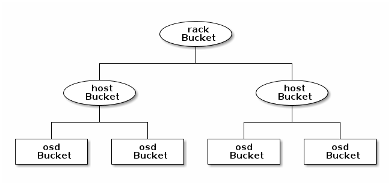

CRUSH
=====

The CRUSH algorithm enables Ceph clients to communicate directly with the OSDs
rather than through a centralized server, thus avoiding a single point of
failure and limits to the cluster's scalability.

The CRUSH algorithm is a pseudo-random deterministic data distribution
algorithm that maps a placement group to a list of devices on which to store
object replicas.

CRUSH requires a map of the cluster and it uses the hierarchy of devices
defined there to segregate nodes by their failure domains, such as hosts,
racks, rooms and data centres.

### CRUSH map

First, let's look at the cluster's default CRUSH map:

    ceph osd crush dump

Or, if you want to save the CRUSH map to a file:

    ceph osd getcrushmap -o crushmap.compiled

Ceph will output a compiled CRUSH map, which must be decompiled before editing:

    crushtool -d crushmap.compiled -o crushmap.decompiled

Next we will go through all the concepts in this CRUSH map. The map is
organised in four sections:

* **devices:** a list of all storage devices in the cluster, usually the storage drives corresponding to each OSD daemon.
* **types:** the buckets types used in your CRUSH hierarchy and their assigned weights.
* **buckets:** a list of all bucket instances and their properties.
* **rules:** or the manner of selecting buckets.

#### Bucket types

The bucket types facilitate a hierarchy of nodes and leaves: leaf buckets
represent OSD daemons, while node (non-leaf) buckets represent physical locations in
a hierarchy and are used to aggregate other nodes or leaves. You can use the
existing bucket types or create new ones by adding a line
in the following format:

    type {numeric-id} {bucket-name}

Leaf buckets have weights which are usually based on the relative amount of storage
space. E.g.: 1 TB storage devices use a weight of 1.0, then a 500 GB device would 
have a weight of 0.5. However, weights can also be changed to reflect differences 
in the performance of the storage drive, such as transfer rates.
Node buckets, on the other hand, do not contain any OSDs and therefore 
sum up their children's weights.

The example below illustrates a bucket hierachy modelling a rack with two
host, each host having two OSD daemons.

[&copy; ceph.com](http://ceph.com/docs/master/rados/operations/crush-map/)

#### Bucket instances

New bucket instances can be declared using the following format:

    [bucket-type] [bucket-name] {
            id [a unique negative numeric ID]
            weight [the relative capacity/capability of the item(s)]
            alg [the bucket type: uniform | list | tree | straw ]
            hash [the hash type: 0 by default]
            item [item-name] weight [weight]
    }

There can be multiple *item* lines, corresponding to the bucket's children.

You can add new buckets using the following command:

    ceph osd crush add-bucket rack1 rack

Biuckets can also be moved to a new location:

    ceph osd crush move ceph-1 rack=rack1

#### CRUSH rules

Rules are defined using the following format:

    rule <rulename> {
    
            ruleset <ruleset>
            type [ replicated | erasure ]
            min_size <min-size>
            max_size <max-size>
            step take <bucket-type>
            step [choose|chooseleaf] [firstn|indep] <N> <bucket-type>
            step emit
    }

Notable components of the rule are:

* **step take <bucket-name>:** the rule takes the bucket name and begins iterating down the tree
* **step chooseleaf firstn {num} type {bucket-type}:** selects a set of
  buckets of the specified type and chooses a leaf node from the subtree of
  each bucket. The number of buckets selected is usually the pool's
  replication level.

Adding a simple replicated rule (we will deal with erasure coded pools later)
can be done like so:

    ceph osd crush rule create-simple <name> <root> <type> {firstn|indep}

This creates the CRUSH rule <name> that starts iterating down the tree from
<root>, replicates across buckets of type <type> using a choose mode of
*firstn* by default, or *indep* (prefered for erasure coded pools).

For example, the existing default rule would have been created by the command below:

    ceph osd crush rule create-simple replicated_ruleset default host

You can set a pool to use a rule by:

    ceph osd pool set <poolname> crush_ruleset <rule-id>

Reminder: the *ceph osd tree* command also gives an overview of the cluster's
hierarchy:

    gks@ceph-5:~/my-cluster$ ceph osd tree
    ID WEIGHT  TYPE NAME       UP/DOWN REWEIGHT PRIMARY-AFFINITY
    -1 2.00000 root default
    -2 0.50000     host ceph-1
     0 0.50000         osd.0        up  1.00000          1.00000
    -3 0.50000     host ceph-2
     1 0.50000         osd.1        up  1.00000          1.00000
    -4 0.50000     host ceph-3
     2 0.50000         osd.2        up  1.00000          1.00000
    -5 0.50000     host ceph-4
     3 0.50000         osd.3        up  1.00000          1.00000           

------------------------------------------------------

### Exercise time

Modify the CRUSH map to create the hierarchy below and add a rule such that 
replicas are always placed on different racks.

                  default
                     |
                   room1
            _________|_________
           |                   |
         rack1               rack2
       ____|_____         _____|_____ 
      |          |       |           |
    ceph-1    ceph-2   ceph-3     ceph-4
      |          |       |           |
     osd0      osd1     osd2        osd3

**Hint**: you need to add new buckets for racks and room and then move them around
to create this hierarchy. Then add a new rule and set the pools to use this
new rule.

I would suggest to use the *ceph osd crush* commands to work on the CRUSH map
online, but you can also modify it offline by downloading it, decompiling it and
then editing with an editor of your choice. After editing the CRUSH map, you need to compile 
it and inject it into the cluster:

    crushtool -c crushmap.decompiled -o crushmap-new.compiled
    ceph osd setcrushmap -i crushmap-new.compiled

To verify that the replication is done correctly (i.e. replicas are placed on
OSDs located in different racks), use the **ceph osd map** command again.

------------------------------------------------------

Another useful command for manipulating the data placement is for changing the
weight of an OSD:

    ceph osd crush reweight <name> <weight>

Note that this is different from:

    ceph osd reweight <osd-id> <weight>

which is not a persistent setting and it does not change weights assigned to
buckets above the OSD. This setting changes to 0, for example,
when the OSD gets marked *out*, and then to 1 when it gets marked *in* again.

It can also be used as a corrective measure when, for example, an OSD has a
much higher utilization than the others and we want to temporarily reduce its
weight to distribute the data more evenly. This can also be done automatically
by:

    ceph osd reweight-by-utilization [threshold]

[Next: Ceph Filesystem >>>](cephfs.md)

