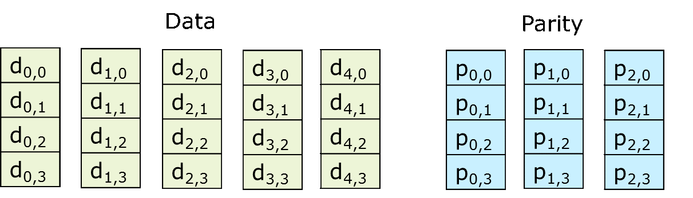

Erasure coding
==============

What is erasure coding?

[&copy; software.intel.com](https://software.intel.com/en-us/blogs/2015/04/06/ceph-erasure-coding-introduction)

* k data blocks + m parity blocks (n=k+m)
* reliability: tolerate m failures
* save storage space
    * encoding rate: r = k/n
    * storage space required: 1/r
* more compute intensive
    * encoding: typically O(mk)
    * update: typically O(m)
    * decoding: typically O(mk)

Let's create an erasure coded pool named *ecpool*:

    ceph osd pool create ecpool 32 32 erasure

and take a look at the default ec profile:

    ceph osd erasure-code-profile get default

By default, Ceph uses k=2, m=1 and the jerasure plugin. These settings can be
changed by creating a new profile:

    ceph osd erasure-code-profile set myprofile k=3 m=2 ruleset-failure-domain=host

A new pool needs to be created using this profile. However, it's impossible to
use this profile with only 4 OSDs - the minimum number of OSDs needed would be k+m=5.

Let's add a new object to the ec pool:

    rados -p ecpool ls
    echo "erasure coding is cool" > ecfile
    cat ecfile
    rados -p ecpool put ecfile ecfile

To check on how many OSDs this object has been placed:

    ceph osd map ecpool ecfile

According to the settings, the fragments of the object are placed on k+m=3 ODSs:

    osdmap e281 pool 'ecpool' (16) object 'ecfile' -> pg 16.5a3c29d8 (16.18) -> up ([2,0,3], p2) acting ([2,0,3], p2)

Let's see what happens if one of the OSDs breaks. On the host where osd.2 is
running, execute:

    service ceph stop osd

The mapping has been changed - osd.2 has been replaced by garbage entry 2147483647:

    $ ceph osd map ecpool ecfile
    osdmap e274 pool 'ecpool' (16) object 'ecfile' -> pg 16.5a3c29d8 (16.18) -> up ([2147483647,0,3], p0) acting ([2147483647,0,3], p0)

Taking the osd.2 out of the cluster normally starts rebalancing:

    ceph osd out 2

A new OSD will now recover the fragment that was located on osd.2:

    $ ceph osd map ecpool ecfile
    osdmap e274 pool 'ecpool' (16) object 'ecfile' -> pg 16.5a3c29d8 (16.18) -> up ([1,0,3], p0) acting ([1,0,3], p0)

Thus, our erasure coded pool tolerates the failure of any m=1 chunks.

Restart osd.2 to bring the cluster back to a healthy state:

    service ceph start osd
    ceph osd in 2

----------------------------
### Exercise time

Experiment with fault tolerance by comparing what happens when one vs two OSDs
break:

* get the list of OSDs where object *ecfile* is placed
* stop the first OSD
* try to dowload the object from the Ceph cluster using *rados get*
* stop the second OSD
* try to download the object again

What do you observe? Can you explain why this happens?

----------------------------

[Finally: Troubleshooting challenge >>>](troubleshooting.md)
