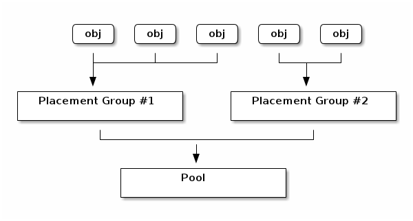

Operating a Ceph cluster
========================

In this section we will go through some basic commands to operate the Ceph
cluster.

help is your friend!

    ceph -h
    ceph osd pool -h
    
To check the cluster health, status and get all kinds of stats:

    ceph health
    ceph status
    ceph osd dump
    ceph osd tree
    ceph -w

Ceph user management:

    ceph auth list

### Ceph data placement

Ceph dynamically stores and rebalances objects across the RADOS cluster. To
ensure scalable and reliable data placement, Ceph uses three concepts:

* **Pools:** logical groups for storing objects. Each pool has its own
  replication level, ruleset and placement groups. User permissions are also set
  at pool level.
* **Placement Groups:** fragments of a pool that place objects as a group into OSDs.
* **CRUSH Maps:** description of the physical topology of the cluster used by
  the CRUSH algorithm to determine where the data for an object and its
  replicas should be stored.

[&copy; ceph.com](http://ceph.com/docs/master/rados/operations/placement-groups/)

List all the existing pools in the Ceph cluster:

    ceph osd lspools

Now let's create a new pool and set the replication level to 3:

    ceph osd pool create data 128
    ceph osd pool set data size 2

When creating a pool, the recommended number of PGs is given by the formula:

                 (OSDs * 100)
    Total PGs =  ------------
                  pool size

rounded up to the nearest power of two, for CRUSH to evenly balance the number
of objects among placement groups.
This formula tries to optimise and balance out resource usage, data durability
and distribution.

Ceph offers an online PG calculator depending on your use case at <http://ceph.com/pgcalc/>.

Other operations on pools include: getting/setting different attributes (such as the number of placement groups or a quota), creating snapshots:

    ceph osd pool get data pg_num
    ceph osd pool set rbd pg_num 128
    ceph osd pool set-quota data max_objects 10000
    ceph osd pool mksnap data data-snapshot

Ceph placement groups

    ceph pg stat
    ceph pg <pgid> query

When you create a pool, PGs go through different states:

    creating -> peering -> active

A PG can be in one of the following states:

* **active+clean:** normal state; the PG can process requests and correct number of replicas available
* **degraded:** PG has fewer replicas available than required by pool size (possibly because an OSD is down)
* **recovering:** when an OSD comes back up, the PG is catching up from the degraded state
* **backfilling:** just like recovering, but starting with an empty replica
* **incomplete:** the PG has fewer replicas available than the pool's min_size
* **inconsistent:** a previous scrub or deep-scrub operation detected errors; ceph pg repair required
* **down:** critical data missing, the PG is unavailable (to recover, either bring the OSD back or declare it lost)

Now let's create an object and save it in the Ceph cluster. Create a text file
with an editor of your choice and then use *rados put* to add it to a specific
pool:

    vim first-object.txt
    rados put first-object first-object.txt --pool=data

To verify if the object was stored:

    rados -p data ls

Find the object location by executing:

    ceph osd map data first-object

The command prints the PG to which the object is mapped, as well as the OSD(s)
where is is located:

    osdmap e65 pool 'data' (1) object 'first-object' -> pg 1.1b82a787 (1.87) -> up ([1,3], p1) acting ([1,3], p1)

The *rados* command also offers different ways to manage the objects and pools in the cluster:

    rados df
    rados rm first-object --pool data
    rados get first-object first-object-copy.txt --pool data
    rados stat first-object --pool data
    rados lspools

Let's see what happens to the cluster if we take out one of the OSDs:

    gks@ceph-1:~$ sudo service ceph stop osd.0

Check the status of the cluster and PG states with:

    ceph health detail

[Next: CRUSH >>>](crush.md)
