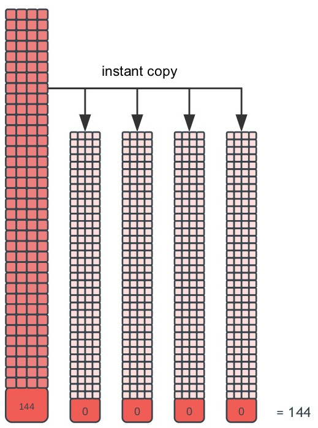
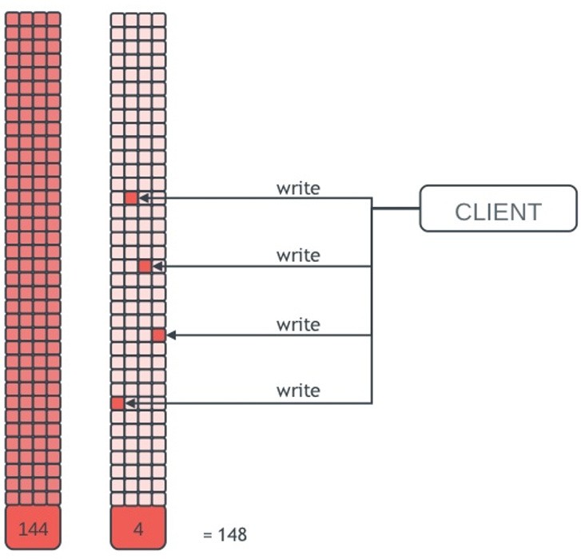
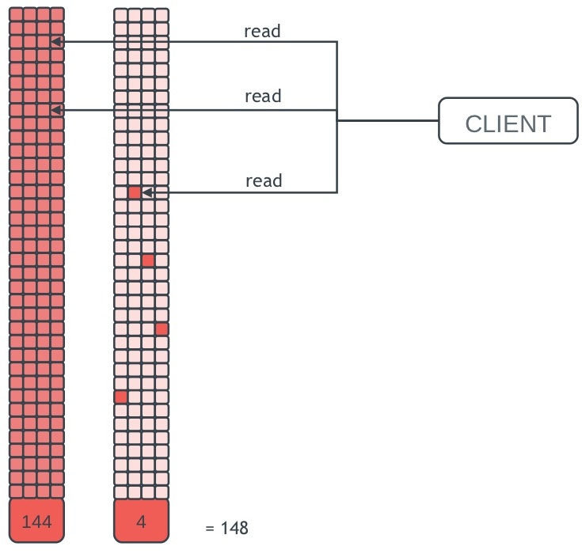

Rados Block Device (RBD)
========================

Block-based storage interfaces (that support reading and writing of data in
fixed-size blocks) are the most common way to store data on rotating media. By
offering a block interface and integration with *Qemu/KVM* and *libvirt*, Ceph can
be used as back-end for cloud computing (e.g. OpenStack, CloudStack).

Ceph stores block/*rbd* images by striping them over RADOS objects, similar to
CephFS.

### Basic operations

The *rbd* pool was already created when we deployed the cluster. To create and
manipulate rbd images, we use the *rbd* tool:

Create a new image of size 256 MB:

    rbd create --size 256 foo

List all rbd images:

    rbd ls

Show detailed information on a specific image:

    rbd info foo

Resize the *foo* image to 512 MB:

    rbd resize --size 512 foo

Ceph block images are thin-provisioned, meaning that they don't use any actual
physical storage until you begin saving data to them. To check how much space
the rbd pool is using:

    rados df

Let's try writing some data to our *foo* image by using RBD's benchmarking
tool and then checking again the storage space used by the *rbd* pool:

    rbd bench-write foo
    rados df

### Snapshots

Snapshots are read-only copies of the state of an image at a specific point in time. 

You can create a snapshot:

    rbd snap create rbd/foo@ohsnap

list all snapshots of a specific image:

    rbd snap ls rbd/foo

or roll back to a snapshot:

    rbd snap rollback rbd/foo@ohsnap

However, rolling back to a snapshot means overwriting the image and thus takes
longer than cloning from a snapshot.

### Layering

Ceph supports so-called *layering* of snapshots, i.e. copy-on-write clones of a
block device snapshot. This allows you to clone images (e.g. VM images) quickly
and easily.

[&copy;slideshare.net](http://www.slideshare.net/xen_com_mgr/block-storage-for-vms-with-ceph)

How does it work:

* **create rbd image**: snapshotting is supported only for *--image-format 2*
* **create a snapshot**
* **protect snapshot** from being deleted, otherwise all COW clones would break 
* **clone snapshot**: the cloned image now has a reference to the parent snapshot,
  and includes the pool ID, image ID and snapshot ID
* **flatten clone** (if you want to delete the initial snapshots): copies the
  information from the parent snapshot to the clone and removes all references
  to the parent
* **unprotect snapshot** so that it can be deleted
* **remove snapshot**

The steps are illustrated in the commands below (check between each command the
amount of storage in the *rbd* pool):

    rados df | grep rbd
    rbd create bar --image-format 2 --size 256
    rbd snap create bar@ohsnap
    rbd protect bar@ohsnap
    rbd clone bar@ohsnap new-bar
    rbd children bar@ohsnap
    rbd flatten new-bar
    rbd snap unprotect bar@ohsnap
    rbd snap rm bar@ohsnap

### RBD clients

We will not cover RBD clients in this tutorial, but there are several ways to
access RBD images, all covered in the
[docs](http://ceph.com/docs/master/rbd/rbd/):

* RBD **kernel module**
* **librbd** library - the userspace implementation
* KVMs such as **Qemu** that rely on librbd
* cloud computing systems such as **OpenStack** and **CloudStack** that rely on
  *libvirt* and *Qemu* to integrate with Ceph RBD

[Next: Erasure coding >>>](erasure.md)
