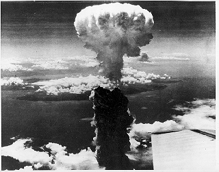

Troubleshooting challenge
=========================

After we got everything to work, let's destroy the clusters!!

 [&copy; trumanlibrary.org](http://www.trumanlibrary.org/teacher/abomb.htm)

**Idea:** each one of you will create a few exploits that will break something in
your Ceph cluster. Next, pair up with another workshop participant and give
them access to your cluster. They will try to troubleshoot the problems and
fix them, while you troubleshoot their cluster.

#### Example exploits

* kill a Ceph daemon (monitor or OSD)
* add a firewall REJECT rule to iptables e.g. to block the port the monitor listens on (6789)
* change replication level to something higher than your CRUSH rules allow
  (e.g. 3 when you replicate across racks and only have two racks)
* change CRUSH rule so that it cannot be satisfied (e.g. set chooseleaf type to datacenter)
* user management (*ceph auth list*): remove a user or change *caps* to
  restrict access 
* think of a sequence of operations and failures that might lead to data not
  being completely replicated.

Or be creative and come up with your own! (but don't cut off ssh access to the
VMs)

#### Troubleshooting strategies

* check the logs on each node in /var/log/ceph
* use the admin daemon sockets on each node to view and modify runtime configuration or get different statistics:

        sudo ceph --admin-daemon /var/run/ceph/ceph-osd.0.asok config show
        sudo ceph --admin-daemon /var/run/ceph/ceph-osd.0.asok config set debug_osd 1/10 # log/memory level
        sudo ceph --admin-daemon /var/run/ceph/ceph-mon.ceph-1.asok mon_status
  
* use *ceph health detail* to get more information about the problems your
  cluster is facing, e.g. IDs of degraded placement groups
* get more info on problematic PGs with:

        ceph pg <pgid> query

* explicitly list different stuck PGs with

        ceph pg dump_stuck stale     # possible cause: OSD not running
        ceph pg dump_stuck inactive  # peering problem
        ceph pg dump_stuck unclean   # unfound objects

* missing objects can be listed with

        ceph pg <pgid> list_missing

* if nothing more can be done about missing objects, it's time to let them go:

        ceph pg <pgid> mark_unfound_lost revert|delete

* similar for OSDs, if there is a catastrophic disk failure and it cannot be
  recovered:

        ceph osd lost <id>

* inconsistent PGs can be fixed with

        ceph pg repair <pgid>

Don't forget the Ceph docs at <http://docs.ceph.com/docs/master/>.
